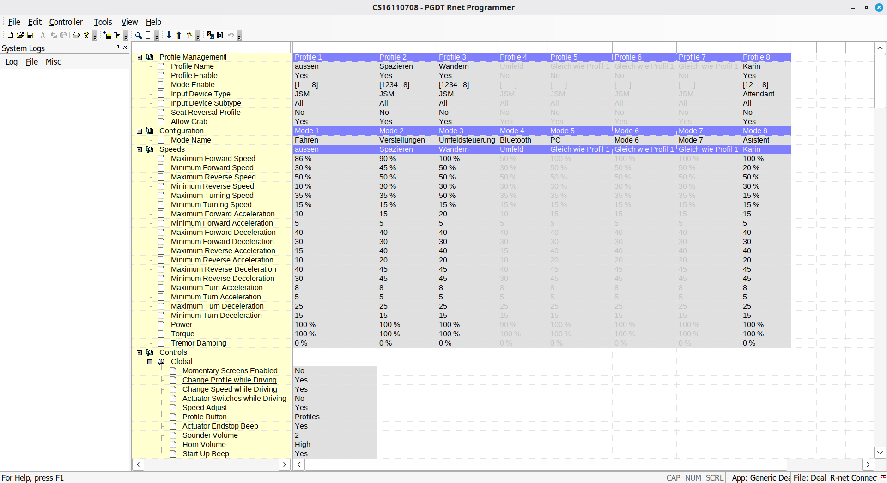

<p align="center">
  
</p>

<h1 align="center">free R-Net</h1>

<p align="center"><strong>RNet-Dongle-Emu</strong> · CAN-only R-Net dongle bridge, wheelchair emulator and analysis toolkit.</p>

> **Research / interoperability project.**
> This is not a safety certification and must not be used to approve a mobility
> device for operation. Device-specific real-wheelchair wiring, live programming
> procedures and the Dealer-to-OEM dongle switch are intentionally not
> documented here.

## Current architecture — CAN only

As of **2026-10-10**, the DLL-local wheelchair/replay backend has been removed
from the runtime path. `ftd2xx.dll` accepts only `Device=canN` and acts as the
FTD2XX/R-Net dongle endpoint plus a transport bridge to the native
`rnet-can-proxy`.

Wheelchair emulation is a separate process on the CAN test pair:

```text
R-Net Programmer
       |
   ftd2xx.dll
       |
  Device=can0
       |
rnet-can-proxy
       |
      can0
       |
   CAN test pair
       |
      can1
       |
 rollstuhl.emu
```

`Device=emu` is intentionally no longer supported. This avoids having two
independent wheelchair emulators: one hidden in the DLL and one on SocketCAN.

The CAN-only DLL still emulates the **dongle-local** FTD2XX/R-Net control
functions required by the Programmer. Wheelchair CAN frames themselves are
sent to and received from the external CAN interface.

## Emulator status

The software test path has been exercised end-to-end:

- **connect: OK**
- **read: OK**
- **write: OK**

This result applies to the emulator/test setup. It is not a claim that writing
to a real wheelchair has been validated or is safe.

A separate real-CAN test with a **You-Q test wheelchair** previously confirmed
that the Programmer can read the wheelchair configuration through a CAN
interface. Device-specific connection details and the Dealer-to-OEM switch are
outside this repository.

## `start.sh emu`

The normal test entry point is:

```bash
./start.sh emu
```

It performs the complete local setup:

1. stops an older Programmer/proxy/chair instance;
2. configures `can0` and `can1` as classic CAN at **125000 bit/s**;
3. builds missing DLL/proxy/chair components;
4. deploys the CAN-only DLL and writes `Device=can0`;
5. starts `rnet-can-proxy` on `can0`;
6. starts the Qt6 `rollstuhl.emu` on `can1`;
7. starts R-Net Programmer under Wine.

Useful commands:

```bash
./start.sh status
./start.sh stop
```

Interface names and CAN setup can be adjusted without editing the script:

```bash
RNET_CAN_DONGLE=can0 \
RNET_CAN_CHAIR=can1 \
RNET_CAN_BITRATE=125000 \
./start.sh emu
```

Set `RNET_CAN_SETUP=0` only when the interfaces have already been configured by
another service.

## `rollstuhl.emu`

`rollstuhl.emu` is the software wheelchair node. The current Qt6 GUI models the
CJSM2 controls and uses a `QGraphicsScene`/`QGraphicsView` for the display.
Its replay responses, GUI-generated events and cyclic CAN frames all travel on
`can1`; the DLL does not synthesize those wheelchair frames.

V22 reverses JSM Y only at the CAN encoding boundary: joystick forward/up is
positive R-Net Y and backward/down is negative R-Net Y, while Qt screen/mouse
coordinates remain unchanged.

The ON/OFF controls now emit CAN power sequences. Power-on sends the observed
startup prefix (`00C`, `00E`, `7B3`, serial/network frames, `7B1`, `7B0`) before
normal cyclic traffic resumes. Power-off stops normal cyclic traffic
immediately, then emits the observed `002`/`002#R` + `004` sleep cadence for
about 11.05 seconds and terminates with `000`/`000#R`; after that
`rollstuhl.emu` is silent on CAN.

## Configuration

The runtime INI is intentionally small:

```ini
[emulator]
Device=can0
LogFile=ftd2xx-emu.log
```

Valid device values are `can0`, `can1`, ... . `Device=emu`, `Mode=replay` and a
DLL-local `ReplayFile` are no longer runtime modes.

## Build

On Fedora, the project uses CMake/Ninja, MinGW32 for the DLL and Qt6 for
`rollstuhl.emu`. The normal helper is:

```bash
scripts/build-can0-rollstuhl-emu.sh release emu
```

The helper builds:

```text
build/mingw32/ftd2xx.dll
build/rnet-can-proxy/rnet-can-proxy
build/rollstuhl.emu/rollstuhl.emu
```

The CAN-only build enables function/data sections and linker garbage collection
so no longer referenced legacy local-emulator helpers are discarded from the
release DLL.

## Branding

The project now ships with the **free R-Net** logo/icon set in `assets/branding/`.
The Qt wheelchair emulator window uses the bundled app icon, and the emulator GUI also shows the logo in its header. The documentation embeds the same branding assets. See [Branding notes](docs/BRANDING.md).
The branding resources use fixed Qt resource aliases plus filesystem fallbacks so the app icon and header logo remain visible in `rollstuhl.emu`.

## Repository layout

```text
src/                    CAN-only FTD2XX/R-Net DLL source
rollstuhl.emu/          Qt6 CAN wheelchair emulator / CJSM2 GUI
tools/rnet-can-proxy/   native SocketCAN <-> localhost bridge
cmake/toolchains/       MinGW32 cross-compilation toolchain
tools/                  analysis/decryption utilities
tests/                  parser and protocol tests
docs/                   protocol, validation and compatibility notes
scripts/                build/deployment/cleanup helpers
run/                    runtime logs and PID files
```

## RND analysis and configuration reports

The existing RND and `.R-net` analysis tools remain unchanged. Vendor programs,
vendor DLLs, original/decrypted `.rnd` databases, customer `.R-net` files,
replay captures and device state are not distributed as project content.

See:

- [Protocol notes](docs/PROTOCOL.md)
- [Validation](docs/VALIDATION.md)
- [Compatibility](docs/COMPATIBILITY.md)

## Screenshots

### R-Net Programmer with the emulated dongle



### R-Net Programmer application information


## Acknowledgements

Special thanks to **Constantin Grosch <groschorama@gmail.com>**, who provided an
R-Net Programmer dongle free of charge for approximately 1.5 years. That loan
made the protocol analysis, comparison testing and development work possible.

Thanks also to **ChatGPT by OpenAI** for assistance with protocol/log analysis,
debugging, documentation and coding during development.

### rollstuhl.emu startup state

Beginning with V23, `rollstuhl.emu` always starts with **power OFF**. Normal wheelchair cyclic CAN traffic is silent until ON/OFF is pressed. Switching on runs the captured PowerOn CAN sequence before normal periodic traffic starts.
