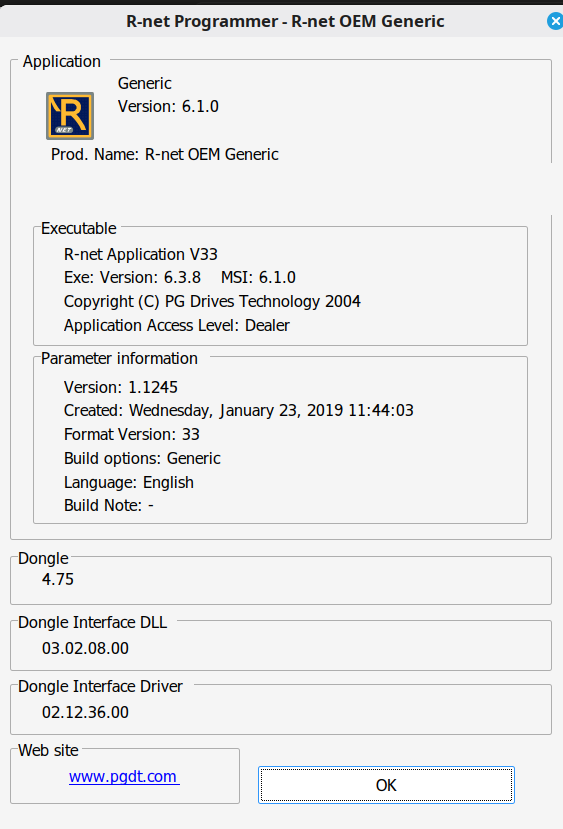
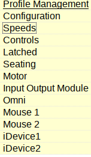

# Tested compatibility

The implementation has been developed against the following observed software
set:

- Application: **R-Net OEM Generic 6.1.0**
- Executable: **R-net Application V33**, executable version **6.3.8**
- Parameter information: **1.1245**, format version **3**, Generic, English
- Parameter information creation date: **2019-01-23**
- Dongle firmware/version shown by application: **4.75**
- Dongle Interface DLL: **03.02.08.00**
- Dongle Interface Driver: **02.12.36.00**

## Backend compatibility

The project accepts these backend forms in `ftd2xx-emu.ini`:

- `Device=emu` — self-contained emulator.
- `Device=canN` — SocketCAN backend, for example `Device=can0`.

The emulator/test workflow is confirmed to connect, read and write as of
2026-10-08.

A separate real-CAN test has confirmed reading the configuration of a You-Q test
wheelchair. This is not a real-wheelchair write-validation statement.

## Programmer tree

The examined parameter browser exposes the main configuration sections shown
below.

Other Programmer, RND or Dongle Interface releases can differ in FTD2XX calls,
startup/re-enumeration behavior, replay ordering, repository layout, RND
encryption or parameter metadata.
